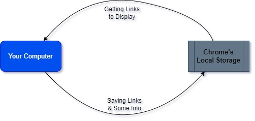

# PinLinks Project (Chrome Extension)

👋🏻👋🏻 **Welcome lets start creating a new extension:**

## About Project

Our project, PinLinks, is a Chrome extension designed for easy management of web links. It allows users to save, organize, and easily navigate to different web links directly from their Chrome browser. Users can categorize their saved links into different collections based on genre or type, providing a highly organized and user-friendly interface for managing their favorite websites. 

This extension is designed to be simple and intuitive, making it accessible even to those who are new to using browser extensions.

<h3>
💡 (Requirements) Define Your Requirements

</h3>

### Problems It solves:

- Save Different web-links into chrome
    
    You can Save & easily Manipulate your different Links.
    
- One Click easy Navigation
    
    You can navigate to your link just by one-click.
    
- Save Links as ‘collection’
    
    Save Links as “Collection” according to their type (Genre).
    
- User-Friendly
    
    Completely user friendly even for someone new to use. 
    

<h3>
🖌️ (Design) How It works?

</h3>

<h3>
👨🏻‍💻 (Development) Let’s code

</h3>

- [ ]  Create basic Setup (Including GitHub connect)
- [ ]  Defining basic Layout (Includes Responsive-Design)
- [ ]  Connecting to Local-Storage

<h3>
🐞 (Testing) Testing & Deployment

</h3>

- [ ]  Requirement Testing + ChatGPT Testing
- [ ]  Development and setting upcoming improvements

<h3>
🤖 (Maintenance) Future Improvements

</h3>

- [ ]  Implement a tagging system for better organization of links
- [ ]  Integrate with popular bookmarking services for seamless data transfer
- [ ]  Add multi-language support to cater to a global audience
- [ ]  Add functionality to import and export collections for easy sharing
- [ ]  If suitable make it Open-source